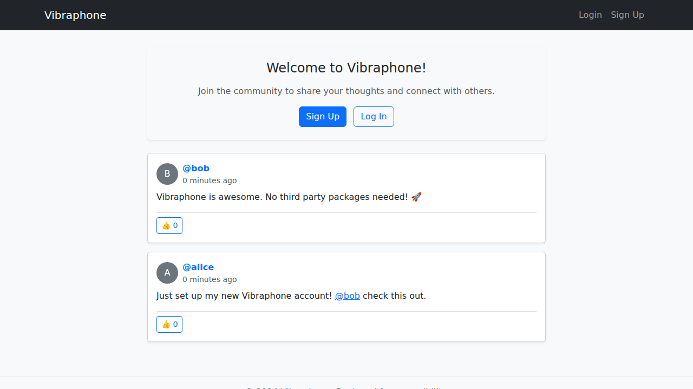
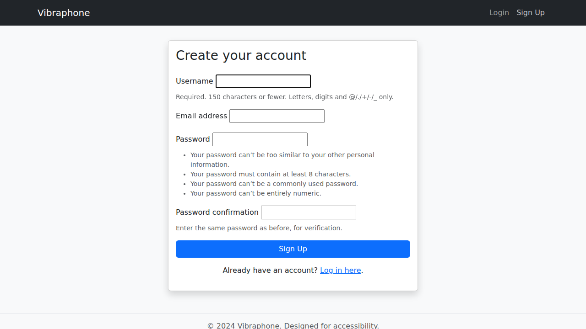

# Vibraphone 🎵

Vibraphone is a lightweight, accessible microblogging platform built with **Django 6**, **HTMX**, and **Bootstrap 5**.

## Features

- **Custom User Profiles**: Extensive user data including bios, locations, and profile images.
- **Microblogging Core**: Create, edit, and delete posts with image support.
- **Dynamic Interactions**: HTMX-powered infinite scroll, inline post editing, and liking.
- **Engagement**: Mention users with `@username` and send private messages.
- **Anonymous Interaction**: Session-based likes for users who aren't logged in.
- **Accessibility**: Built with WCAG 2.0 AA compliance in mind.
- **No 3rd Party Django Packages**: Built using core Django features and standalone libraries (`psycopg`, `Pillow`).

## Screenshots

### Home Feed (Logged Out)


### Sign Up Page


## Quick Start

### 1. Prerequisites
- Python 3.10+
- PostgreSQL (optional, defaults to SQLite)

### 2. Installation
```bash
pip install Django==6.0.3 psycopg[binary] Pillow
```

### 3. Setup
```bash
python manage.py migrate
python manage.py collectstatic
```

### 4. Run
```bash
python manage.py runserver
```

## Testing
Run the comprehensive test suite with:
```bash
python manage.py test
```
